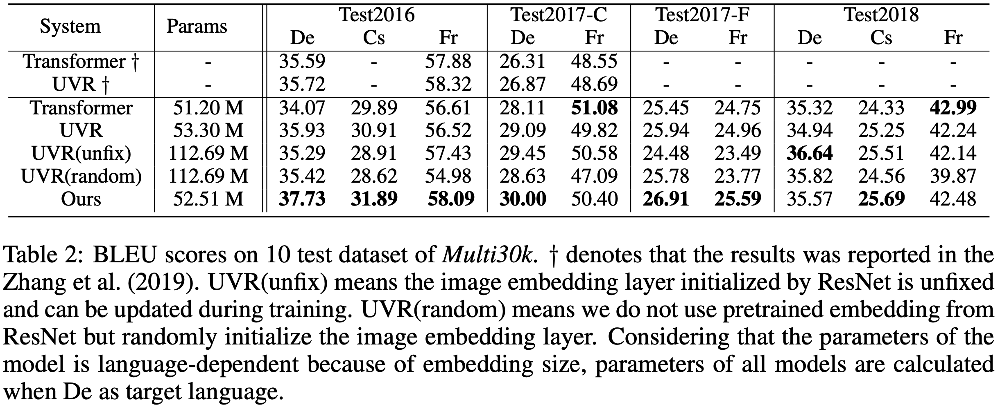

# UTR_NMT

This repo is for final project of **Vison and Language** instructed by [Prof. Yang Liu](http://www.csyangliu.com).

This project is based on the paper **NEURAL MACHINE TRANSLATION WITH UNIVERSAL VISUAL REPRESENTATION** [link](https://openreview.net/pdf?id=Byl8hhNYPS) published at ICLR2020. And we mainly try to figure out what is behind the scene in terms of improved translation quality? And the conclusion is:

> In Universal Visual Representation model, it is not **Visual** but **Universal** that truly matters.

Concretely, we propose a Universal Texutal Representation model without introducing any visual features and achieves comparable results even with less parameters. And the main idea of our project is to use a text-based *Keyword Net* to replace *Topic-image lookup table*, and explicitly modeling the co-occurrence between simialr training samples.




## How to run

here is the software requirement for the project

```bash
# torch version is based on cuda version
torch==1.9.1
transformers==4.9.0
sacrebleu==2.0.0
nltk==3.6.5
scikit-learn==1.0.1
```

- for UVR model, you should download ResNet Feature Embedding [link](https://drive.google.com/file/d/1BK6UUc1mNOYjo_tqf4D7LZLlpaE3MEvl/view?usp=sharing), and put it in the **data** folder, then change `config.py` by setting `use_image=True` . Then run by `python main.py`
- for UTR model, you need first change the `config.py` by `use_keyword=True`  ,than directly run `python main.py`.

All other config can be change in `config.py` including batch_size, learning_rate...
